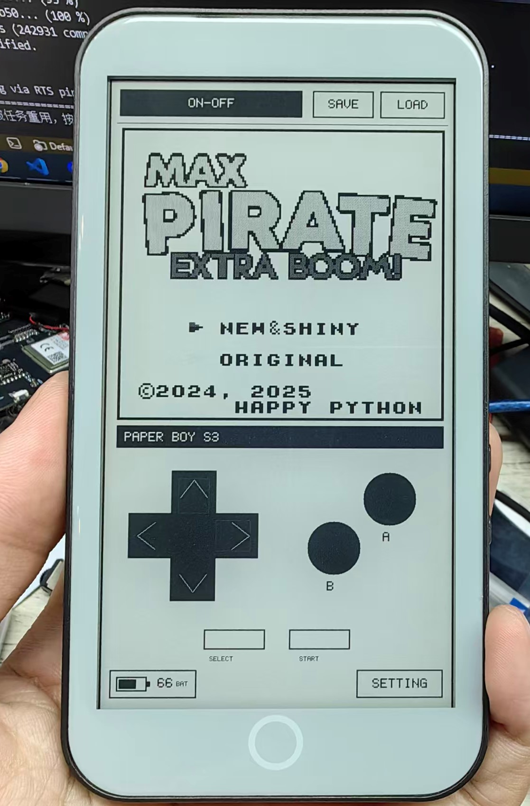
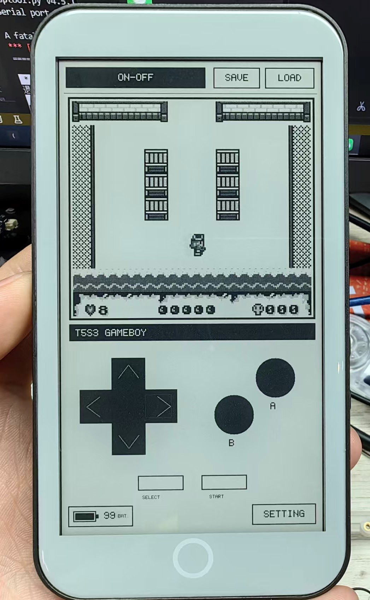

# T5S3-GameBoy

**中文** | [English](README.md)

基于 [LilyGO T5S3-4.7-e-paper-PRO](https://github.com/Xinyuan-LilyGO/T5S3-4.7-e-paper-PRO) 的竖屏触摸 Game Boy（DMG）模拟器。项目使用
Peanut-GB、GT911、BQ27220、BQ25896 和 1bpp 墨水屏实时刷新方案。


|  |  |
| --- | --- |

## 功能

- 480×432 Game Boy 画面，固定像素抖动转换为清晰的 1bpp 黑白输出。
- 屏幕十字键、A/B、SELECT/START 多点触摸控制。
- 内存快速存档和读档；断电或复位后存档会丢失。
- 设置、Battery Status、SD Card 占位页面和 About System 页面。
- BQ27220 电量计与 BQ25896 充电管理，主页面显示电量和充电状态。
- `BOOT` 键执行白→黑→白清屏并重绘当前页面。
- 主页面长按 `IO48` 实体按键 2 秒，清屏显示提示后安全关机。
- 长按 `PWR` 开机

## 项目结构

```text
T5S3-GameBoy/
├─ src/                   主程序、显示、触摸和模拟器源码
│  ├─ gbcore/             Peanut-GB 核心
│  └─ rom/                自定义 ROM 说明及生成后的 test_rom.h
├─ lib/                   BQ25896、BQ27220 和 I²C 兼容层
├─ boards/                LilyGO T5S3 PlatformIO 板卡配置
├─ tools/                 .gb ROM 转换工具
├─ firmware/              发布固件
└─ platformio.ini         唯一的项目构建配置
```

## 编译与烧录

在项目根目录执行：

```powershell
pio run
pio run -t upload --upload-port COM45
pio device monitor -p COM45 -b 115200
```

默认且唯一的 PlatformIO 环境名为 `T5S3-GameBoy`。

## 使用自己的游戏 ROM

以 `maxpirateeb.gb` 游戏为例，如何更新自己的游戏：
1. 在授权游戏站点下载目标游戏的 `.gb` 文件
2. 将 `.gb` 文件放入到该项目的 ROMs/ 文件夹下
3. 最后使用一下命令下载到设备中，注意 `COM` 使用自己的串口
```powershell
python tools/gb_rom_to_header.py .\ROMs\maxpirateeb.gb
pio run -t clean
pio run -t upload --upload-port COM45
```


工具默认生成 `src/rom/test_rom.h`。该文件存在时会替换内置演示 ROM；删除它并重新
编译即可恢复内置 ROM。生成文件默认不提交到 Git，避免误提交受版权保护的数据。

当前不支持仅限 Game Boy Color 的 `.gbc` 游戏，也暂未输出声音。

可查找明确授权自制游戏的站点：

- <https://hh.gbdev.io/search?typetag=game>
- <https://itch.io/games/tag-gameboy>
- <https://itch.io/jams/tag-gameboy>

请选择标明 DMG、Original Game Boy 或 Game Boy compatible 的 `.gb` 文件。`GBC only`
游戏当前无法运行；“老游戏”“绝版”或 “abandonware” 也不代表可以合法下载。

## 充电参数

充电方案与 T5S3-Reader 保持一致：

- 输入电流上限：1000 mA
- 快充电流：512 mA
- 预充/终止电流：64/64 mA
- 满充电压：4208 mV
- 最低系统电压：3300 mV
- 电池模型容量：1500 mAh

固件不会在 NTC、温度或安全计时故障期间强制恢复充电。
